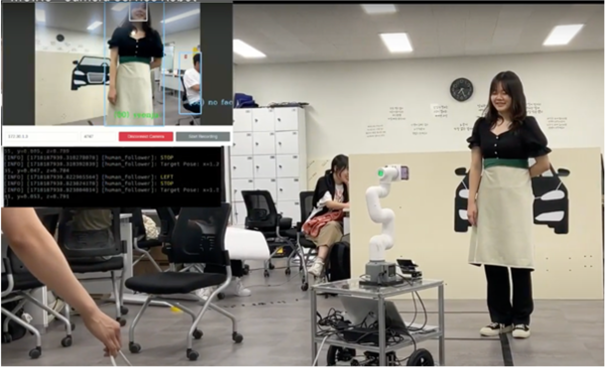
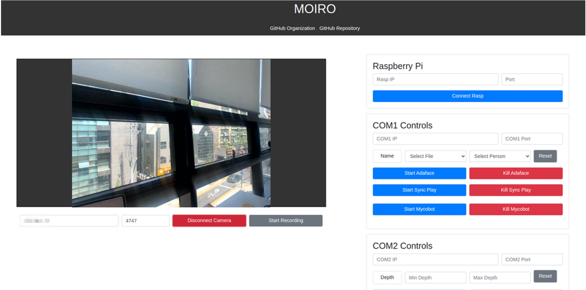
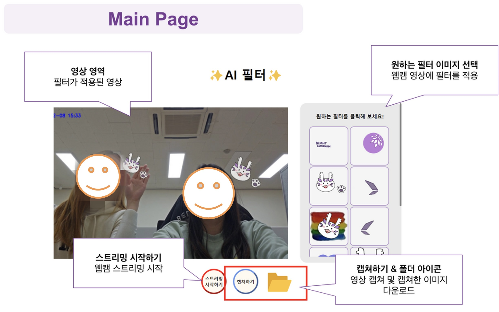
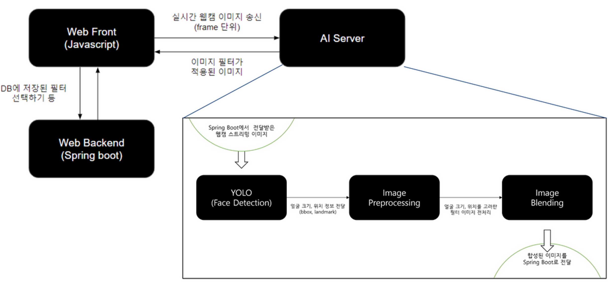
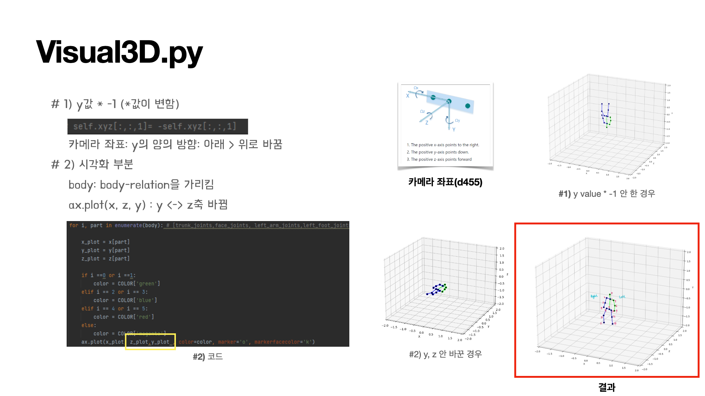
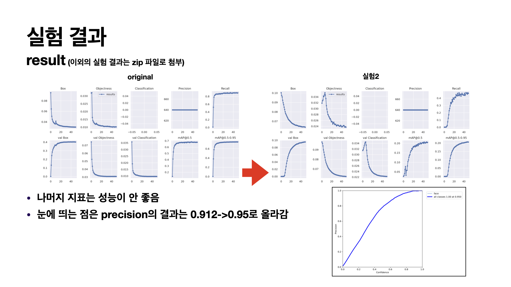
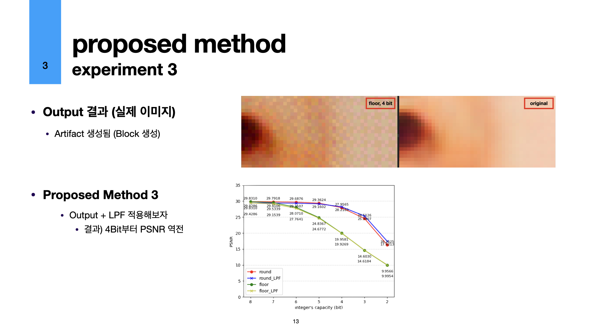

### 👋 AI 모델의 취약점을 최소화하는 개발자, 이연주입니다 🖥️
안녕하세요! **AI 모델의 취약점을 최소화**하는 개발자가 되고 싶은 이연주입니다. 😊

**AI**가 우리의 삶에 점점 더 깊숙이 들어오는 요즘, 그 기술이 **얼마나 신뢰할 수 있는지**가 정말 중요하다고 생각합니다. **하드웨어 기기**를 대상으로 한 프로젝트에 더 많은 흥미를 느끼고 있으며, 프로젝트를 진행할 때 더욱 **신뢰성과 안정성**에 심혈을 기울이고 있어요.

AI 기술이 사용자에게 믿음을 줄 수 있도록 기여하고, **신뢰성 높은 AI 서비스**를 만드는 것을 지향하고 있습니다. 함께 고민하고 나누어요! 🤲🏻

## KG-Kairos 1기 활동 (2024.01 ~ 2024.06)
  - Vision AI를 이용한 서비스 촬영 로봇: 객체 탐지 모델(Yolov8)과 얼굴 인식 모델(Adaface)을 결합하여, 특정 인물을 따라가는 로봇을 구현. 로봇은 특정 인물을 따라가 촬영 서비스를 제공
    > Linux 환경 + 객체 탐지 & 얼굴 인식 모델을 이용한 human follower 하는 로봇 구현, Depth Camera 이용, Flask 서버 구현(여러 원격 컴퓨터에 제어 명령어를 보내, 하나의 웹에서 여러 컴퓨터 제어 가능하도록 구현), 모든 기능은 ROS2-Humble 패키지화하여 구현
    - 팀 MOIRO 깃허브 [MOIRO-KAIROS](https://github.com/MOIRO-KAIROS)
    - 통합 워크스페이스 [moiro_ws](https://github.com/MOIRO-KAIROS/moiro_ws)
    - 주요 개발 파트 [moiro_vision](https://github.com/MOIRO-KAIROS/moiro_vision) - demo ver. [faceRec](https://github.com/MOIRO-KAIROS/faceRec)
    - 시연 영상 [유튜브 링크](https://www.youtube.com/watch?v=wvV16o518Vw&themeRefresh=1)

  
  
  

## 프로젝트
  - 문자맥락형 도서추천 앱 서비스(외부 한이음 프로젝트): GPT 기반 문장맥락 이해형 유사 도서 추천 및 검색 알고리즘 담당 > 메타인지
      > SBert 네트워크를 참고하여, KoGPT를 이용한 추천 알고리즘을 구축 (설계 아이디어 및 구현에 대한 내용에 대해 알고 싶다면, [cometext-gpt](https://github.com/Hanium-Cometext/cometext-gpt)에서 참고)
  - 실시간 얼굴 필터 웹 서비스(교내 캡스톤 프로젝트): LINUX 환경 + 얼굴 탐지 알고리즘 + Flask 서버 연결 + 실시간 처리 + 필터 적용 + Web Server(Spring Boot)와 AI Server(Flask) 연동 (링크: [AI-Flask](https://github.com/Filter-Web/AI), 시연 영상: [유튜브 링크](https://www.youtube.com/watch?v=wvV16o518Vw))

  
  
  

## 학부인턴십 (2022.07 ~ 2024.02)
  - 최근 연구 및 실험: SR 연산에 대한 LUT(Look-Up Table) bit 줄이기 (링크: [SR_LUT](https://github.com/yeonju52/SR-LUT))
  - 이전 연구 및 실험: YOLOv5으로 얼굴 탐지 - 1. 작은 object를 더 잘 탐지하도록, 저조도 이미지에서 더 잘 탐지하도록 (링크: [yolov5-face](https://github.com/yeonju52/yolov5-face))
  - 전반적인 공부 및 실습: [Computer Vision](https://github.com/yeonju52/ComputerVision)    

  
  
  

### 랭킹 (백준)
[velog](https://velog.io/@yeonju52/series/%EC%BD%94%ED%85%8CC)를 통해 `알고리즘 TIL 기록`을 진행하고 있습니다.

<!--

-->

<!--
**yeonju52/yeonju52** is a ✨ _special_ ✨ repository because its `README.md` (this file) appears on your GitHub profile.

Here are some ideas to get you started:

- 🔭 I’m currently working on ...
- 🌱 I’m currently learning ...
- 👯 I’m looking to collaborate on ...
- 🤔 I’m looking for help with ...
- 💬 Ask me about ...
- 📫 How to reach me: ...
- 😄 Pronouns: ...
- ⚡ Fun fact: ...
-->

<!-- 20~63

### 🖥️ Open-Source Projects
<table>
<tr><th>AI</th><th>Development</th></tr>
<tr><td>

|Title | Stars | Technologies|
|--|--|--|
| [Minecraft-AI](https://github.com/drkostas/Minecraft-AI) |  | |
| [3D Semantic Segmentation](https://github.com/drkostas/3D-Semantic-Segmentation) |  |  |
| [Bert Question-Answering](https://github.com/drkostas/Bert-Question-Answering) |  |  |
| [Accident Severity Pred.](https://github.com/drkostas/accident-severity-prediction) |  |  |
| [Hybrid Girvan Newman](https://github.com/drkostas/HGN) |  |     |
| [Vanilla Numpy NN](https://github.com/drkostas/Numpy-NeuralNet-1) |  | |

</td><td>

|Title | Stars | Technologies|
|--|--|--|
| [Cloud File Manager](https://github.com/drkostas/cloud-filemanager) |  |      |
| [Color Logger](https://github.com/drkostas/termcolor-logger) |  |    |
| [Email Sender](https://github.com/drkostas/pyemail-sender) |  |       |
</td></tr> </table>

📈 Stats

 
My Github Stats

 

 

 
Currently Coding & Listening to:

-->
