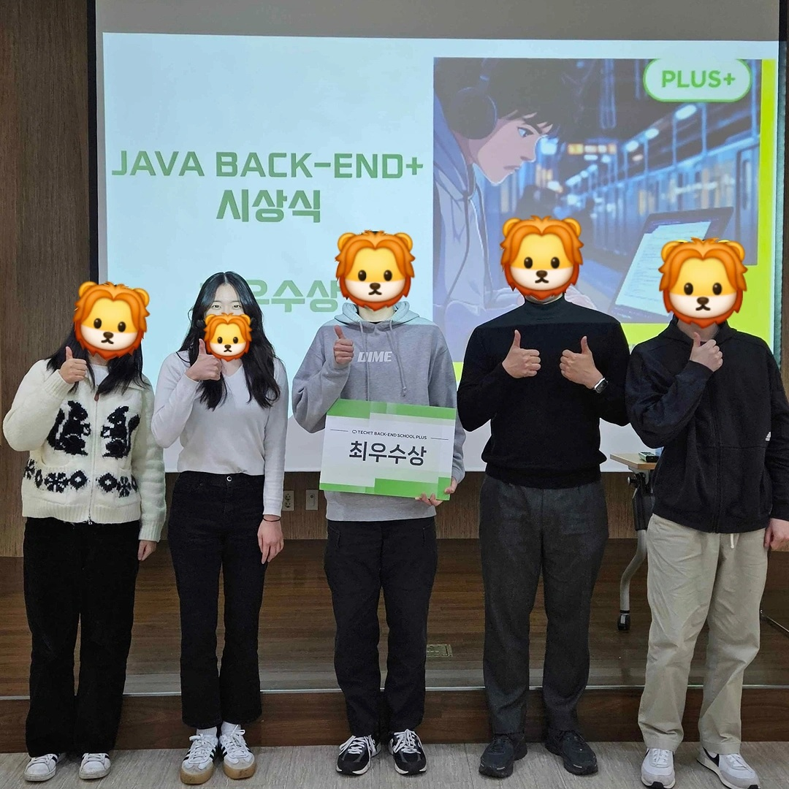
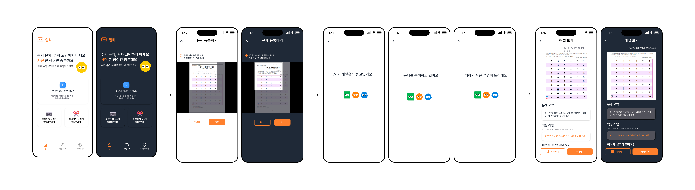
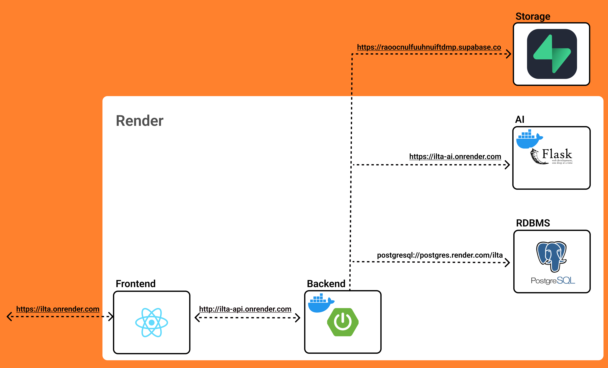
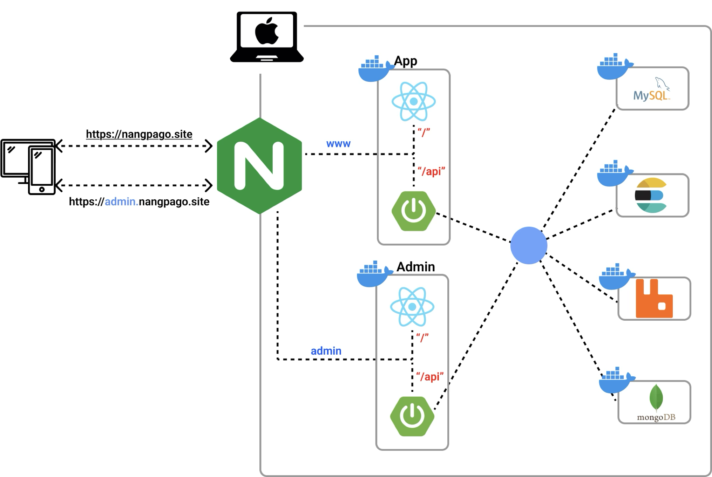
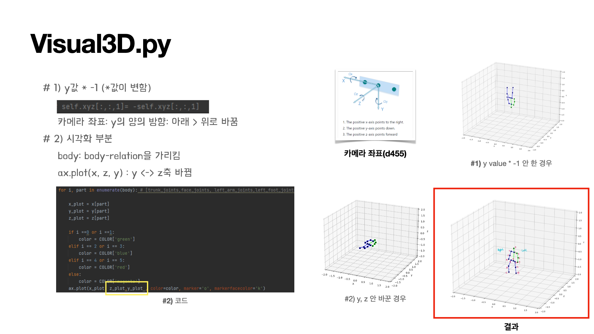

# 👋 YeonJu Lee - Backend & AI Developer  

**Backend Developer** passionate about integrating **AI technologies** into **web and embedded systems**.  

## AI 기능을 서비스 로직에 녹여내는 백엔드 개발자

AI 기능을 서비스에 통합하여 **팀이 지속적으로 운영할 수 있는 구조로 비즈니스 로직을 구현하는 것**을 지향합니다.

인턴 프로젝트에서는 **OpenAI API를 활용한 LLM 기반 해설 기능**을 백엔드에 통합했습니다. 모델 호출과 데이터 처리 로직을 **별도 레이어로 분리하여**, 기능 확장이나 모델 변경에도 **서비스 전체가 안정적으로 동작하도록 설계했습니다.**

## 🛠️ Tech Stack

 <!-- 💻 Language -->
  
   

 <!-- 🌱 Framework -->
  
  
   

 <!-- 🗄️ Database -->
  
  
  
   

 <!-- 🔍 Infra / Message Queue / AI -->
  
  
   

 <!-- ⚙️ DevOps / Tools -->
  
  
   

---

## 🌟 Intern

### [ILTA(일타) — AI 수학 선생님 웹 서비스](https://github.com/ocy-likelion/AI_teacher_2_backend/)

LLM과 OCR을 결합해 **학부모가 문제 이미지를 업로드하면 자녀에게 설명할 수 있도록 해설을 제공하는 AI 기반 수학 학습 도우미**

* **GPT API 기반 해설 생성 로직** 구현으로 QA 정확도 95% 달성
* **OCR 전처리(pytesseract)** 로 수식 인식률 향상 (lang='kor+eng+equ')
* Render 기반 **CI/CD 파이프라인 구축** (256MB 환경에서 모델 경량화)
* Stack: Spring Boot · Flask · PostgreSQL · OpenAI API · Render

---

## 🌟 Projects

### [NangPaGo(냉파고) — Elasticsearch 기반 검색·추천 웹 서비스](https://github.com/MARS-LIKELION/NangPaGo)

**Elasticsearch 기반 자연어 검색 시스템**으로 사용자의 재료 입력에 맞춰 **맞춤형 레시피를 추천**하고,
**비동기 이벤트 아키텍처 기반 실시간 커뮤니티·알림 기능**을 제공하는 웹 서비스

* **Elasticsearch 기반 검색 및 자동완성 API** 구현으로 검색 응답속도 85% 개선
* **RabbitMQ + SSE 이벤트 아키텍처** 로 좋아요 토글 및 실시간 알림 기능 구현
* **Admin Dashboard** 구축으로 통계·감사 로그 실시간 모니터링
* Stack: Spring Boot · MySQL · Elasticsearch · Docker · Jenkins

[👉 서비스 배포 URL](https://nangpago.site/)

 

### [MOIRO — Vision AI 자율 촬영 로봇](https://github.com/MOIRO-KAIROS/moiro_ws)
Flask 기반 RESTful API로 로봇(AGV·로봇 암·카메라)을 통합 제어하는 하드웨어-소프트웨어 오케스트레이션 시스템  
- 3대 디바이스 통합 제어로 13fps/15fps 실시간 프레임 유지율 달성  
- **Stack:** Flask, ROS2, YOLOv8, AdaFace

 

### [AIFT — 실시간 얼굴 필터 웹 서비스](https://github.com/Filter-Web/AI)
Spring Boot와 Flask를 연동해 웹캠 영상을 실시간으로 인식·처리하는 얼굴 필터 웹 서비스  
- NVIDIA GPU를 활용한 AI 객체 탐지 모델을 Flask 서버에 배포하고, 이를 웹과 실시간 연동하여 스트리밍 기반 얼굴 필터 적용 구현
- **Stack:** Spring Boot, Flask, OpenCV, YOLO-Face

 

### [Cometext — 문장 맥락 기반 도서 추천 시스템](https://github.com/Hanium-Cometext/cometext-gpt)
KoGPT와 S-BERT를 결합해 문장의 의미를 벡터화하고 유사도 기반으로 도서를 추천하는 자연어 처리 서비스  
- 기존 연구를 벤치마킹해 자체 데이터셋에 특화된 GPT 기반 문맥 검색 시스템을 독자적으로 구현
- **Stack:** Flask, PyTorch, KoGPT, S-BERT

### [CRM 고객 이탈 예측 모델](https://github.com/yeonju52/Market_RecSys.git)
고객 행동 데이터를 기반으로 LightGBM·NCF 모델을 활용해 이탈 예측 및 맞춤형 상품 추천을 수행한 프로젝트  
- LGBM 모델로 F1 Score 0.73 달성, 세분화된 고객군 타깃팅 성공  
- **Stack:** Pandas, LightGBM, PyTorch

<!--
|          Project          |                                                                                  Preview                                                                                  |
| :-----------------------: | :-----------------------------------------------------------------------------------------------------------------------------------------------------------------------: |
|        **NangPaGo**       |                    |
|         **MOIRO**         |                      |
|          **AIFT**         |                                                              |
|        **Cometext**       |                                                                                                                     |
| **Research & Internship** |    |
-->

---

## 📊 Algorithm & Study

- [Velog — 알고리즘 TIL 기록](https://velog.io/@yeonju52/series/%EC%BD%94%ED%85%8CC)  
- [학부연구 인턴십 — Computer Vision Research](https://github.com/yeonju52/ComputerVision.git)

  
---

  © 2025 YeonJu Lee — Backend & AI Developer

