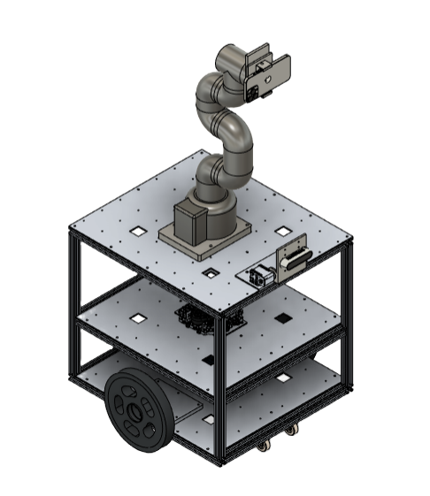

# YeonJu Lee - Backend & AI
## 🌟 **프로젝트**
### **Elasticsearch 기반 검색 및 추천 웹 서비스**

RESTful API 개발, 서버 아키텍처 설계, Elasticsearch를 활용한 검색 성능 최적화

**성과**
  - RabbitMQ 이벤트 아키텍처 적용으로 '좋아요' 기능 DB Lock 문제 해결
  - 평균 응답 속도 약 85% 개선
  - SSE(Server-Sent Events) 적용으로 실시간 데이터 동기화 구현
**기술 스택**
  - 백엔드: Spring Boot, MySQL, MongoDB, Elasticsearch, RabbitMQ
  - DevOps: Jenkins, Docker, GitHub Actions
**링크**
  - [GitHub Repository](https://github.com/MARS-LIKELION/NangPaGo)
  - [배포 URL](https://nangpago.site/)

  
  
  

### **KG-KAIROS Vision AI 기반 서비스 로봇 설계**

Flask 기반 웹 플랫폼으로 자율 로봇을 제어하고, AI를 활용해 특정 인물을 추적하며 촬영 결과를 실시간으로 제공

**성과**
  - Intel RealSense를 활용한 3차원 센서 입력 기반 로봇 제어 및 AI 추적으로 특정 인물 위치 실시간 촬영
  - 전체 파이프라인(FPS: 센서 입력 → AI 추론 → 로봇 제어 → 촬영 스트리밍) 평균 13FPS → 15FPS, 약 87% 성능 향상
  - Flask 기반 웹 플랫폼으로 이기종 장치를 통합 제어 가능
  - Yolov8 객체 인식과 AdaFace 얼굴 인식을 결합하여 특정 인물만 추적하도록 AI 추론 모델 설계 및 적용
**기술 스택**
  - 백엔드: Flask, ROS2, Ubuntu
  - AI: Pytorch, OpenCV
  - 하드웨어: Arduino, Raspberry Pi
**링크**
  - [GitHub Repository](https://github.com/MOIRO-KAIROS/moiro_ws)
  - [시연 영상](https://www.youtube.com/watch?v=wvV16o518Vw&themeRefresh=1)

  
  
  

### **AIFT: 실시간 얼굴 필터 웹 서비스 개발**

Spring Boot와 Flask를 통합하여 웹과 AI 서버를 연동, 웹캠 이미지를 송신하고 인코딩하여 실시간 스트리밍 서비스 구현

**성과**
  - REST API 기반 통신으로 웹 클라이언트와 AI 서버 연동 구현
  - 2D 객체 인식 및 종횡비 기반 알고리즘으로 자연스러운 필터 구현
  - 실시간 스트리밍 구조 설계로 웹에서 즉시 필터 적용 결과 확인 가능

**기술 스택**
  - 백엔드: Spring Boot, Flask
  - AI: Pytorch, OpenCV
**링크**
  - [GitHub Repository](https://github.com/Filter-Web/AI)
  - [시연 영상](https://www.youtube.com/watch?v=wvV16o518Vw)

  

### **문장맥락형 도서추천 앱 (Hanium ICT Mentoring Project)**

GPT와 KoGPT를 활용한 도서 추천 시스템 설계, KoGPT 및 S-BERT 아키텍처로 성능 최적화

**성과**
  - 자체 구축 데이터셋 기반 KoGPT + sentence-BERT 연동 도서 추천 시스템 구현
  - GPT/KoGPT 추론 결과를 벡터화하여 DB에 저장, 검색 속도 최적화
**기술 스택**
  - 백엔드: Django, Kotlin
  - AI: PyTorch, KoGPT
**링크**
  - [GitHub Repository](https://github.com/Hanium-Cometext/cometext-gpt)
  - [시연 영상](https://youtu.be/HM0ExHpEnNA?si=v_ZHeHOi-ZATArSk)

  
  

### **CRM 기반 고객 이탈 예측 모델**

빅데이터 기반 고객 행동 분석 및 추천 시스템 구현

**성과**
  - EDA를 통해 고객 이탈과 맞춤형 추천 두 가지 문제 정의
  - 고객 이탈 예측 모델: LightGBM 기반 AutoML 적용, 입력 데이터 전처리 및 모델 구현
  - 맞춤형 상품 추천 시스템: Neural Collaborative Filtering(NCF) 모델 설계 및 구현, 입력 데이터 전처리 포함
  - 대규모 마켓 데이터를 기반으로 정확도 향상 및 개인화 추천 구현, F1 Score 73% 달성
**기술 스택**
  - 데이터 처리: Pandas
  - 머신러닝: LightGBM
**링크**
  - [GitHub Repository](https://github.com/yeonju52/Market_RecSys.git)
  - [PPT 자료](https://github.com/yeonju52/Market_RecSys/blob/main/Final_Submission.pdf)

### **KBO 데이터 분석 프로젝트**

Pandas와 Selenium으로 KBO 데이터 분석 및 시각화

**기술 스택**
  - 데이터 처리: Pandas
  - 웹 크롤링: Selenium

## 📚 **연구 & 실습**
### **YOLOv5 얼굴 탐지 성능 개선 연구**

YOLOv5-Face를 기반으로 성능 최적화 및 실험

### **SR LUT (Super-Resolution) 연구**

LUT 기반 슈퍼 해상도 성능 연구 및 양자화 최적화

  
  
  

## 알고리즘

[velog](https://velog.io/@yeonju52/series/%EC%BD%94%ED%85%8CC)에서 알고리즘 TIL 기록 진행

