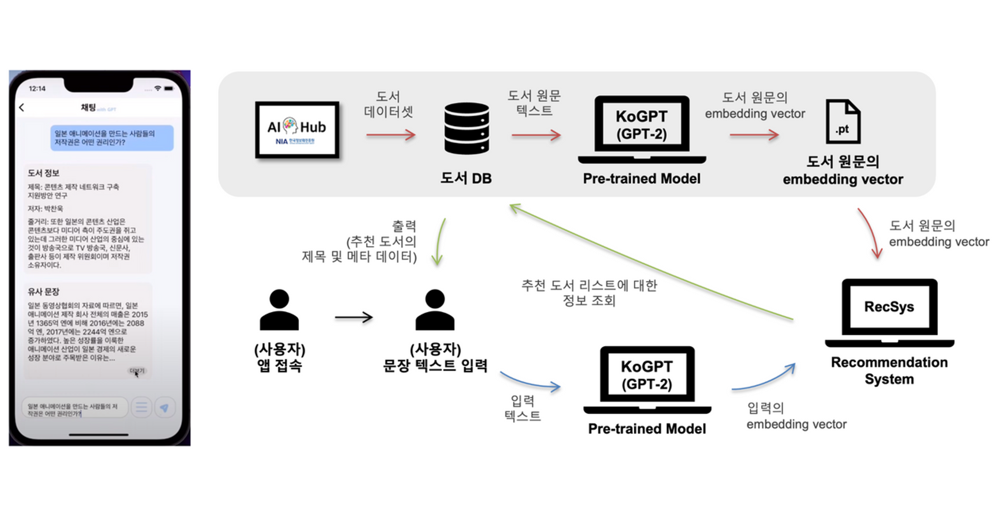

# 👋 YeonJu Lee - Backend & AI Developer  

**Backend Developer** focusing on integrating AI into web and embedded systems  
주요 관심 분야는 **AI 기반 백엔드 아키텍처 설계**, **시스템 통합**, **실시간 데이터 처리**입니다.

---

## 🛠️ Tech Stack

 <!-- 💻 Language -->
  
   

 <!-- 🌱 Framework -->
  
  
   

 <!-- 🗄️ Database -->
  
  
  
   

 <!-- 🔍 Infra / Message Queue / AI -->
  
  
   

 <!-- ⚙️ DevOps / Tools -->
  
  
   

---

## 🌟 Intern

### [ILTA(일타) — AI 수학 선생님 웹 서비스](https://github.com/ocy-likelion/AI_teacher_2_backend/)
LLM과 OCR을 활용해 학부모가 문제 사진을 업로드하면 풀이 해설을 제공하는 AI 수학 선생님 웹 서비스  
- **성과:** LLM 기반 자동 해설 기능으로 QA 응답률 95% 달성  
- **Stack:** Spring Boot, Flask, OpenAI API  

---

## 🌟 Projects

<!--

  
📸 Project Preview (클릭하면 접힙니다)

  
| Project | Preview |
|:--:|:--:|
| **NangPaGo** |    |
| **MOIRO** |    |
| **AIFT** |   |
| **Cometext** |  |
| **CRM Model** |     |

-->

### [NangPaGo(냉파고) — Elasticsearch 기반 검색·추천 웹 서비스](https://github.com/MARS-LIKELION/NangPaGo)
Elasticsearch 기반 자연어 검색과 RabbitMQ 이벤트 아키텍처를 적용해 사용자의 재료 입력에 맞춰 레시피를 추천하는 웹 서비스 [👉배포 URL](https://nangpago.site/)
- **성과:** 비동기 이벤트 처리로 검색 응답속도 85% 개선  
- **Stack:** Spring Boot, MySQL, Elasticsearch, RabbitMQ

  

### [MOIRO — Vision AI 자율 촬영 로봇](https://github.com/MOIRO-KAIROS/moiro_ws)
Flask 기반 RESTful API로 로봇(AGV·로봇 암·카메라)을 통합 제어하는 하드웨어-소프트웨어 오케스트레이션 시스템  
- **성과:** 3대 디바이스 통합 제어로 13fps/15fps 실시간 프레임 유지율 달성  
- **Stack:** Flask, ROS2, YOLOv8, AdaFace

  

### [AIFT — 실시간 얼굴 필터 웹 서비스](https://github.com/Filter-Web/AI)
Spring Boot와 Flask를 연동해 웹캠 영상을 실시간으로 인식·처리하는 얼굴 필터 웹 서비스  
- **성과:** NVIDIA GPU를 활용한 AI 객체 탐지 모델을 Flask 서버에 배포하고, 이를 웹과 실시간 연동하여 스트리밍 기반 얼굴 필터 적용 구현
- **Stack:** Spring Boot, Flask, OpenCV, YOLO-Face

 

### [Cometext — 문장 맥락 기반 도서 추천 시스템](https://github.com/Hanium-Cometext/cometext-gpt)
KoGPT와 S-BERT를 결합해 문장의 의미를 벡터화하고 유사도 기반으로 도서를 추천하는 자연어 처리 서비스  
- **성과:** 기존 연구를 벤치마킹해 자체 데이터셋에 특화된 GPT 기반 문맥 검색 시스템을 독자적으로 구현
- **Stack:** Flask, PyTorch, KoGPT, S-BERT

### [CRM 고객 이탈 예측 모델](https://github.com/yeonju52/Market_RecSys.git)
고객 행동 데이터를 기반으로 LightGBM·NCF 모델을 활용해 이탈 예측 및 맞춤형 상품 추천을 수행한 프로젝트  
- **성과:** LGBM 모델로 F1 Score 0.73 달성, 세분화된 고객군 타깃팅 성공  
- **Stack:** Pandas, LightGBM, PyTorch

  

<!--
|          Project          |                                                                                  Preview                                                                                  |
| :-----------------------: | :-----------------------------------------------------------------------------------------------------------------------------------------------------------------------: |
|        **NangPaGo**       |                    |
|         **MOIRO**         |                      |
|          **AIFT**         |                                                              |
|        **Cometext**       |                                                                                                                     |
| **Research & Internship** |    |
-->

---

## 📊 Algorithm & Study

- [Velog — 알고리즘 TIL 기록](https://velog.io/@yeonju52/series/%EC%BD%94%ED%85%8CC)  
- [학부연구 인턴십 — Computer Vision Research](https://github.com/yeonju52/ComputerVision.git)

---

  © 2025 YeonJu Lee — Backend & AI Developer

